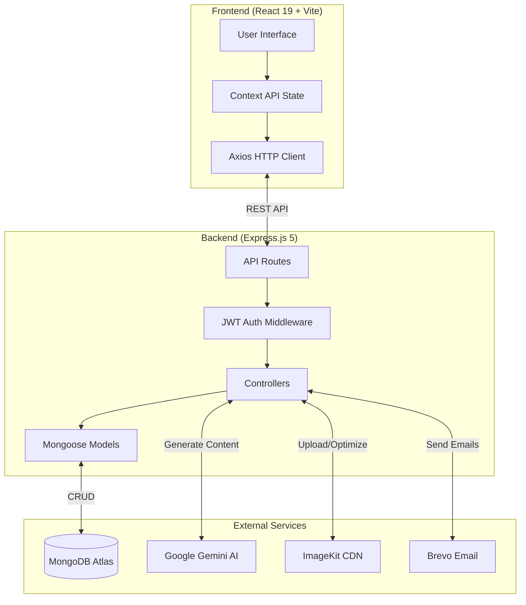
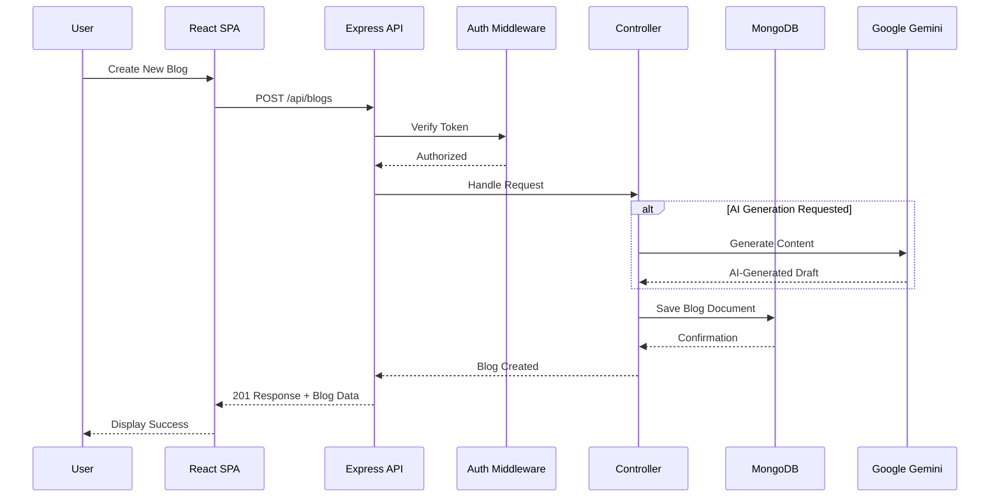

<div align="center">

# QuickBlog — AI-Powered Blogging Platform

### *Where Intelligent Content Creation Meets Modern Web Architecture*

[](https://react.dev/)
[](https://nodejs.org/)
[](https://expressjs.com/)
[](https://www.mongodb.com/)
[](https://tailwindcss.com/)
[](https://ai.google.dev/)
[](LICENSE)
[](/)

</div>

---

## Project Overview

**QuickBlog** is a production-grade, full-stack blogging platform that revolutionizes content creation through the seamless integration of **Artificial Intelligence**. Built on the modern **MERN stack** (MongoDB, Express.js, React, Node.js), it empowers bloggers to publish high-quality content faster while maintaining complete control over their creative process.

### Key Problem Solved

Traditional blogging platforms require significant time investment for content creation, lack intelligent writing assistance, and often compromise between functionality and user experience. **QuickBlog addresses these pain points by:**

| Challenge | QuickBlog Solution |
|-----------|-------------------|
| Writer's block & slow content creation | AI-powered draft generation using Google Gemini |
| Poor media management | Automatic image optimization via ImageKit CDN |
| Complex content discovery | Full-text search with relevance scoring |
| Subscriber engagement | Automated email notifications via Brevo |
| Security concerns | JWT authentication with role-based access control |

---

## Key Features

<table>
<tr>
<td width="50%">

### Content Management
- Rich text editor with Quill.js
- AI-powered blog draft generation
- Auto-save and draft management
- Category and tag organization
- SEO-friendly URL slugs

</td>
<td width="50%">

### AI Integration
- One-click blog generation via Google Gemini
- Intelligent content suggestions
- Markdown and HTML support
- Customizable AI prompts

</td>
</tr>
<tr>
<td width="50%">

### Media & Performance
- ImageKit CDN integration
- Automatic WebP conversion
- On-the-fly image optimization
- Lazy loading implementation

</td>
<td width="50%">

### Security & Admin
- JWT-based authentication
- Admin dashboard for moderation
- Role-based access control (RBAC)
- API rate limiting

</td>
</tr>
<tr>
<td width="50%">

### Search & Discovery
- Full-text search with scoring
- Pagination support
- Related posts suggestions
- Trending content algorithms

</td>
<td width="50%">

### Email & Notifications
- Subscriber management system
- Automated welcome emails
- New post notifications
- Brevo email integration

</td>
</tr>
</table>

---

## System Architecture & Workflow

The application follows a **decoupled client-server architecture** with clear separation of concerns:



### Request-Response Flow



---

## Tech Stack

### Backend Architecture

| Technology | Version | Purpose |
|------------|---------|---------|
| Node.js | 18+ LTS | JavaScript Runtime |
| Express.js | 5.x | Web Framework |
| MongoDB | Atlas | Database (Mongoose ODM) |
| JWT | 9.x | Authentication |
| Swagger | OpenAPI 3.0 | API Documentation |

### Frontend Architecture

| Technology | Version | Purpose |
|------------|---------|---------|
| React | 19.1.0 | UI Framework |
| Vite | 6.x | Build Tool |
| TailwindCSS | 4.x | Styling |
| React Router | 7.x | Client Routing |
| Axios | 1.x | HTTP Client |

### Third-Party Integrations

| Service | Purpose |
|---------|---------|
| **Google Gemini API** | AI-powered content generation |
| **ImageKit** | CDN & real-time image optimization |
| **Brevo** | Transactional email delivery |

---

## Prerequisites

Before installation, ensure the following are configured:

| Requirement | Version | Check Command |
|-------------|---------|---------------|
| Node.js | >= 18.0.0 | `node --version` |
| npm | >= 9.0.0 | `npm --version` |
| MongoDB | Atlas or Local | `mongosh --version` |
| Git | Latest | `git --version` |

### Required API Keys

- [ ] **MongoDB Atlas** connection string ([Get Started](https://www.mongodb.com/atlas))
- [ ] **Google Gemini** API key ([Get API Key](https://ai.google.dev/))
- [ ] **ImageKit** account credentials ([Sign Up](https://imagekit.io/))
- [ ] **Brevo** API key ([Create Account](https://www.brevo.com/))

---

## Installation & Setup

### Step 1: Clone the Repository

```bash
git clone https://github.com/yourusername/QuickBlog-FullStack.git
cd QuickBlog-FullStack
```

---

### Step 2: Backend Configuration

```bash
# Navigate to server directory
cd server

# Install dependencies
npm install
```

Create `.env` file in the `server` directory:

```env
# ═══════════════════════════════════════════════════════════
# SERVER CONFIGURATION
# ═══════════════════════════════════════════════════════════
PORT=3000
NODE_ENV=development

# ═══════════════════════════════════════════════════════════
# DATABASE
# ═══════════════════════════════════════════════════════════
MONGODB_URI=mongodb+srv://<username>:<password>@<cluster>.mongodb.net/quickblog

# ═══════════════════════════════════════════════════════════
# AUTHENTICATION
# ═══════════════════════════════════════════════════════════
JWT_SECRET=your_super_secure_random_string_here
ADMIN_EMAIL=admin@yourdomain.com
ADMIN_PASSWORD=your_secure_admin_password

# ═══════════════════════════════════════════════════════════
# GOOGLE GEMINI AI
# ═══════════════════════════════════════════════════════════
GEMINI_API_KEY=your_google_gemini_api_key

# ═══════════════════════════════════════════════════════════
# IMAGEKIT CDN
# ═══════════════════════════════════════════════════════════
IMAGEKIT_PUBLIC_KEY=your_imagekit_public_key
IMAGEKIT_PRIVATE_KEY=your_imagekit_private_key
IMAGEKIT_URL_ENDPOINT=https://ik.imagekit.io/your_imagekit_id

# ═══════════════════════════════════════════════════════════
# BREVO EMAIL SERVICE
# ═══════════════════════════════════════════════════════════
BREVO_API_KEY=your_brevo_api_key

# ═══════════════════════════════════════════════════════════
# CORS CONFIGURATION
# ═══════════════════════════════════════════════════════════
CLIENT_URL=http://localhost:5173
```

Start the backend server:

```bash
npm run server
# Server running at http://localhost:3000
# API docs at http://localhost:3000/api-docs
```

---

### Step 3: Frontend Configuration

```bash
# Open new terminal & navigate to client
cd ../client

# Install dependencies
npm install
```

Create `.env` file in the `client` directory:

```env
VITE_BASE_URL=http://localhost:3000
```

Start the development server:

```bash
npm run dev
# Application running at http://localhost:5173
```

---

## Usage & API Documentation

### Running the Application

| Component | Command | URL |
|-----------|---------|-----|
| Backend Server | `npm run server` | `http://localhost:3000` |
| Frontend Dev | `npm run dev` | `http://localhost:5173` |
| API Documentation | — | `http://localhost:3000/api-docs` |

### API Endpoints Overview

#### Public Endpoints

| Method | Endpoint | Description |
|--------|----------|-------------|
| `GET` | `/api/blogs` | Fetch all published blogs (paginated) |
| `GET` | `/api/blogs/:slug` | Get single blog by slug |
| `GET` | `/api/blogs/search?q=term` | Full-text search |
| `POST` | `/api/subscribe` | Subscribe to newsletter |

#### Protected Endpoints (Admin)

| Method | Endpoint | Description |
|--------|----------|-------------|
| `POST` | `/api/admin/login` | Admin authentication |
| `POST` | `/api/admin/blogs` | Create new blog |
| `PUT` | `/api/admin/blogs/:id` | Update blog |
| `DELETE` | `/api/admin/blogs/:id` | Delete blog |
| `POST` | `/api/admin/generate` | AI content generation |

### API Examples

#### Fetch Published Blogs

```bash
curl -X GET "http://localhost:3000/api/blogs?page=1&limit=10" \
  -H "Content-Type: application/json"
```

**Response:**
```json
{
  "success": true,
  "data": {
    "blogs": [
      {
        "_id": "64a...",
        "title": "Getting Started with AI",
        "slug": "getting-started-with-ai",
        "excerpt": "Learn how to leverage AI in your projects...",
        "coverImage": "https://ik.imagekit.io/...",
        "createdAt": "2024-12-08T10:30:00Z"
      }
    ],
    "pagination": {
      "currentPage": 1,
      "totalPages": 5,
      "totalBlogs": 48
    }
  }
}
```

#### Admin Login

```bash
curl -X POST "http://localhost:3000/api/admin/login" \
  -H "Content-Type: application/json" \
  -d '{"email": "admin@example.com", "password": "your_password"}'
```

**Response:**
```json
{
  "success": true,
  "token": "eyJhbGciOiJIUzI1NiIsInR5cCI6IkpXVCJ9...",
  "admin": {
    "email": "admin@example.com"
  }
}
```

#### AI Content Generation

```bash
curl -X POST "http://localhost:3000/api/admin/generate" \
  -H "Content-Type: application/json" \
  -H "Authorization: Bearer <your_jwt_token>" \
  -d '{"prompt": "Write a blog about React 19 features"}'
```

---

## Screenshots

> **Add your application screenshots here:**

### Homepage


### Blog Editor


### AI Generation Interface


### Admin Dashboard


### Mobile Responsive View


---

## Deployment

### Backend Deployment (Recommended: Render/Railway)

```bash
# Build command
npm install

# Start command
npm start

# Environment variables: Configure all .env variables in dashboard
```

### Frontend Deployment (Recommended: Vercel/Netlify)

| Configuration | Value |
|---------------|-------|
| Build Command | `npm run build` |
| Output Directory | `dist` |
| Environment Variable | `VITE_BASE_URL=https://your-backend-url.com` |

---

## Project Structure

```
QuickBlog-FullStack/
├── client/                       # React Frontend
│   ├── src/
│   │   ├── components/           # Reusable UI components
│   │   ├── pages/                # Route pages
│   │   ├── context/              # React Context providers
│   │   ├── hooks/                # Custom React hooks
│   │   └── assets/               # Static assets
│   ├── index.html
│   ├── vite.config.js
│   └── package.json
│
├── server/                       # Express Backend
│   ├── controllers/              # Route handlers
│   ├── models/                   # Mongoose schemas
│   ├── routes/                   # API route definitions
│   ├── middleware/               # Auth & validation middleware
│   ├── configs/                  # Database & service configs
│   ├── utils/                    # Helper functions
│   ├── server.js                 # Entry point
│   └── package.json
│
└── README.md
```

---

## Contributors & Acknowledgments

<table>
<tr>
<td align="center">
<strong>Project Lead / Full-Stack Developer</strong><br>
<a href="https://github.com/yourusername">
<!-- Add your photo here -->
<br>
<sub><b>Your Name</b></sub>
</a>
</td>
</tr>
</table>

### Academic Acknowledgments

This project was developed as part of the **Capstone Project** at **[Your University Name]**.

**Faculty Advisor:**
- Prof. [Professor Name] — *Project Supervisor*

### Special Thanks

- **Google** — Gemini AI API
- **ImageKit** — Image CDN services
- **MongoDB** — Database hosting
- **Brevo** — Email delivery platform
- **Open Source Community** — Libraries and tools that made this possible

---

## License

This project is licensed under the **MIT License** — see the [LICENSE](LICENSE) file for details.

---

<div align="center">

### Star this repository if you found it helpful!

**Made with passion for the Developer Community**


</div>
